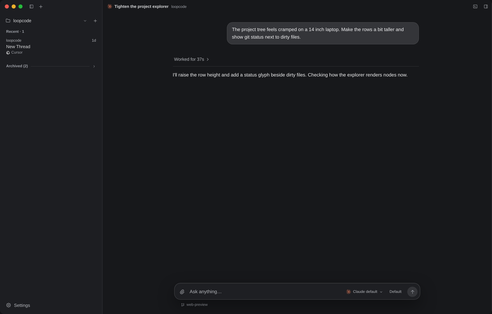

<p align="center">
  
</p>

# LoopCode

**Your coding agents, one desktop workspace.**

[](https://github.com/nonlooped/loopcode/actions/workflows/ci.yml)
[](https://github.com/nonlooped/loopcode/releases/latest)
[](LICENSE)


Run Codex, Claude, Cursor, OpenCode, Grok, Pi, and fx with project-bound threads, visible tool activity, and permission controls. LoopCode is a local desktop workspace for ACP coding agents, not a CLI task orchestrator.



[Latest release](https://github.com/nonlooped/loopcode/releases/latest) · [Build from source](#build-from-source) · [Contribute](CONTRIBUTING.md)

## Why LoopCode?

Agent CLIs work well for one task. They get messy when you juggle projects, providers, terminal tabs, and old conversations. LoopCode keeps the whole job in one window.

- **Pick the right agent.** Use any supported provider per thread.
- **Keep project context.** Threads, drafts, file references, and history survive restarts.
- **See what changed.** Messages, commands, file edits, questions, and approvals share one timeline.
- **Stay in control.** Restricted mode asks before sensitive actions. Full Access removes the prompts when you trust the agent.
- **Work without bouncing around.** Browse files, preview code, attach images, and open the integrated terminal beside the conversation.
- **Keep it local.** LoopCode starts agent processes on your machine and stores workspace history there.

## Supported agents

| Agent    | Install                                                                                                                                                       | Login                         |
| -------- | ------------------------------------------------------------------------------------------------------------------------------------------------------------- | ----------------------------- |
| Codex    | `npm install --global @openai/codex`                                                                                                                          | `codex login`                 |
| Claude   | `npm install --global @anthropic-ai/claude-code`                                                                                                              | `claude auth login`           |
| Cursor   | Linux and macOS: `curl https://cursor.com/install -fsS \| bash`<br>Windows: `irm 'https://cursor.com/install?win32=true' \| iex`                              | `agent login`                 |
| OpenCode | `npm install --global opencode-ai`                                                                                                                            | `opencode auth login`         |
| Grok     | Linux and macOS: `curl -fsSL https://x.ai/cli/install.sh \| bash -s 1.0.5`<br>Windows: `irm https://x.ai/cli/install.ps1 \| iex; grok update --version 1.0.5` | `grok login`                  |
| Pi       | `npm install --global @earendil-works/pi-coding-agent@0.84.2`                                                                                                 | Run `pi`, then enter `/login` |
| fx       | `curl -fsSL https://fx.sh/setup.sh \| bash` on Linux and macOS                                                                                                | `fx login` or `fx setup`      |

LoopCode downloads the pinned Codex, Claude, and Pi ACP adapters on first use. fx is visible but unavailable on Windows because its official release supports Linux and macOS only.

Models, reasoning levels, and fast modes come from each agent, so every thread gets the controls its provider supports.

## Install a release

Download the latest **stable** packages and `SHA256SUMS.txt` from the [latest release](https://github.com/nonlooped/loopcode/releases/latest). Nightly builds are GitHub pre-releases of `master`. Use Stable for daily use.

Windows and Linux packages are unsigned. The macOS app has an ad-hoc signature but is not Developer ID signed or notarized. Verify the checksum before bypassing an operating-system warning.

The macOS DMG supports Apple Silicon and Intel Macs. If macOS reports that LoopCode is damaged, move it to Applications and remove the quarantine attribute:

```sh
xattr -dr com.apple.quarantine /Applications/LoopCode.app
```

Windows SmartScreen may require **More info > Run anyway**. Only bypass Gatekeeper or SmartScreen for a package downloaded from this repository whose checksum matches `SHA256SUMS.txt`.

## Build from source

LoopCode supports Windows 10 or 11, Linux, and macOS.

```sh
git clone https://github.com/nonlooped/loopcode.git
cd loopcode
npm install
npx tauri dev
```

You will need Node.js 24+, npm 12+, Rust, and the [Tauri prerequisites](https://v2.tauri.app/start/prerequisites/) for your operating system.

### Browser preview

Run the real frontend with Tauri's web mocks for browser-driven UI checks:

```sh
npm run web
agent-browser open http://127.0.0.1:1420
agent-browser snapshot -i
```

The preview persists workspace state in local storage and exposes deterministic provider models. Native filesystem, terminal, and agent-process behavior remains available only in the desktop app.

## Built on ACP

LoopCode uses the [Agent Client Protocol](https://agentclientprotocol.com/) to talk to each provider while preserving provider-specific models, tools, and authentication. It currently targets stable ACP v1.

See [CONTRIBUTING.md](CONTRIBUTING.md) for development checks, code conventions, commits, and releases.

## License

LoopCode is [MIT](LICENSE) licensed.

It is not affiliated with OpenAI, Anthropic, Cursor, OpenCode, xAI, or the other agents it can run. Those names are their trademarks.
